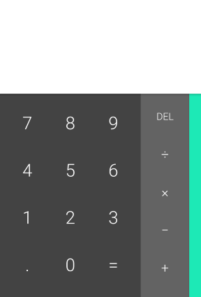
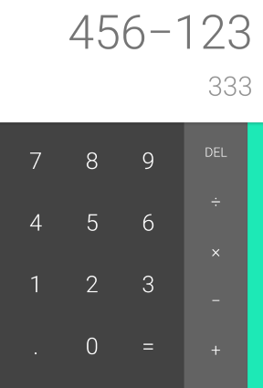
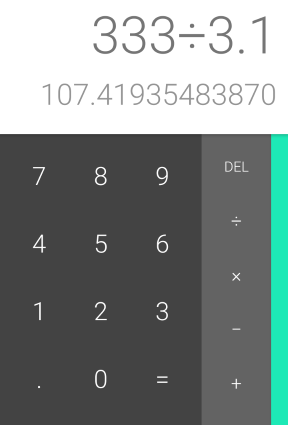

# 计算器

在这个任务中，我们来做一个简单的计算器。这看起来是一个很简单的任务，但是它涉及到一个很重要的概念，[程序的状态](https://en.wikipedia.org/wiki/State_(computer_science)#Program_state)（不需要学习理论解释，运用过程中就会明白）。

## 要求一

下面截图仅为说明计算器的功能，页面样式不需要做到一样。页面设计请自行完成。当然，你可以用截图的样式。

在最开始的时候，页面中的计算器为初始状态：

用户点击按钮，输入算式之后，上方的空白区域，用来显示当前的输入和结果。这个时候，**不**需要按等号，第一行显示输入的算式，第二行显示计时的结果。

按下等号，则把计算结果切换到第一行，当作当前的输入，并等待用户输入。

用户可以根据上一次的计算结果继续进行算式运算。

*Note:* 不需要考虑多级运算和有优先级的运算。每次运算只能包含一个运算符号。当算式出现2个运算符号的时候，显示 *Error* 并阻止等号操作。
