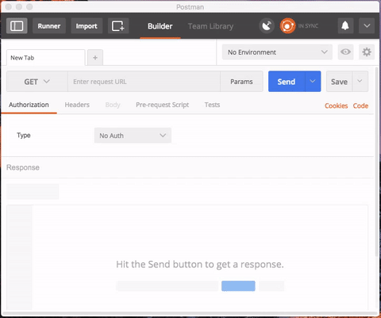

# AJAX

AJAX 的全程是 Asynchronous JavaScript and XM，翻译为“异步的 JavaScript 和 XML”。

AJAX 的出现是解决前一个 Task 的前后端耦合的一些痛点（pain points）。首先，我们需要理解一下，前一个 Task 的 PHP 代码有什么 pain points：

1. HTML 语法和 PHP 语法耦合在一个文件里面。在简单的情况下，这样子可以快速上手，但是项目一大，文件一多，这些混在一起的语法就很难阅读了。
2. 每次请求数据或者保存数据都要整个页面重新刷新。这样子是浪费了网络。如果可以做到保存数据的时候只发送数据，然后返回一个成功或者失败的标记，那数据传输就小了，网络就快了。
3. 不利于测试（test）。虽然我们还没有写过任何的测试代码，但是想象一下如果前端和后端分离，前端开发者只需要管好自己的 JavaScript 代码，后端开发者保证接口可以工作，然后拼在一起就可以工作了。而上一个 Task 耦合的实现是做不到这一点的。

AJAX 就是可以解决这些 paint points。前端技术发展到今天，AJAX 已经被认为是一种基础技术。几乎所有网站都在使用 AJAX 技术。

## 要求一

在前面的所有的 Task 中，我们有一个一直使用但是都没有学习的知识点，那就是 **HTTP**。HTTP 是一种传输协议，浏览器和服务器传输 HTML，JavaScript，CSS，图像都靠它。你需要了解这个协议是干什么的，理解 HTTP 的各种命令（GET，POST 等等），学会使用浏览器 F12 里面的网络工具查看 HTTP 请求。

除了 HTTP 协议，还有需要学习**相对路径（relative path）**和**绝对路径（absolute path）**。路径就是用来指明文件在服务器的什么位置，如果才能找到请求的文件。你需要深刻理解这两种路径表示法的区别。

### 知识点

- HTTP 协议
- 浏览器 F12 的网络工具
- 相对路径和绝对路径

### 参考资料

- http://www.ruanyifeng.com/blog/2016/08/http.html
- https://developer.mozilla.org/zh-CN/docs/Tools/Network_Monitor
- http://www.dreamdu.com/webbuild/relativepath_vs_absolutepath/

## 要求二

在理解完 HTTP 协议，还有需要学习一种轻量级语言——JSON。它的语法是 JavaScript 语法的一部分，用来表示数据。相比于 XML，它是简洁和容易理解。在网络传输过程中，会大量地使用 JSON 格式的数据。

要求使用 JSON 格式，表示[当前项目](https://github.com/lijunle/VickyRoss-Homework)的文件目录结构。然后把文件保存为 `task-12.json` 并存放到 vicky-php 服务器上。

学习使用 Postman 这个工具去测试访问你的 JSON 文件。

### 知识点

- JSON (JavaScript Object Notation)

### 参考资料

- https://zh.wikipedia.org/wiki/JSON
- http://www.w3school.com.cn/json/index.asp
- https://www.getpostman.com/

## 要求三

准备工作做完了，我们终于可以开始学习 AJAX 了。

在 CodePen 创建一个页面。页面开始的时候只有一个按钮，点击按钮之后，发送 AJAX 请求到 vicky-php 服务器请求 `task-12.json` 文件，并在页面上以树形结构把文件目录结构展示出来。

在编写代码访问 `task-12.json` 文件之前，你应该先使用 Postman 确保文件在服务器上，并且能够正确地访问。

### 知识点

- AJAX 请求
- HTTP 路径
- JSON 解释

### 参考资料

- http://www.w3school.com.cn/ajax/index.asp
- http://www.w3school.com.cn/jquery/jquery_ajax_intro.asp

## 要求四

AJAX 请求是异步的，回忆一下 JavaScript event loop 的运行机制，AJAX 是怎么做到的？答案是：事件！

基于 event loop 的运行机制，事件的触发就都必须使用回调函数（callback）进行对应的操作。你数一数上一个要求中，你写了多少个回调函数，回调函数嵌着另外一个回调函数的情况最深到达了多少层。如果逻辑再复杂一点，回调函数的层数会继续增加。这个情况会叫做**回调地狱（callback hell）**。

因为回调地狱的代码实在太难维护，太难阅读了。人们发明了一种叫做 Promise 的方法去解决这个问题。而 jQuery 本身就内置了 Promise 的支持。需要注意，jQuery v1 和 v2 的 Promise 实际上是错误的实现，v3 终于把它修改到正确的道路上来。

要求：把要求三的回调地狱使用 jQuery 的 Promise 解决掉。

### 知识点

- 回调函数（callback）
- 回调地狱（callback hell）
- Promise

### 参考资料

- http://www.erichain.me/front-end/full-stack/2016/02/27/how-to-avoid-callback-hell.html
- http://www.ruanyifeng.com/blog/2011/08/a_detailed_explanation_of_jquery_deferred_object.html
- http://learn.jquery.com/code-organization/deferreds/
