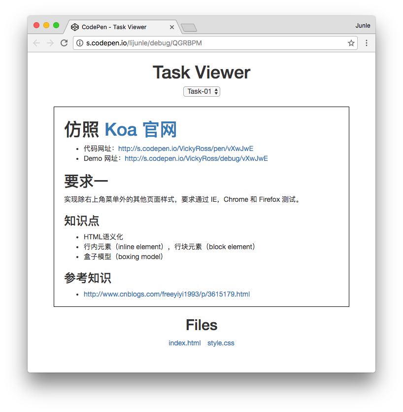
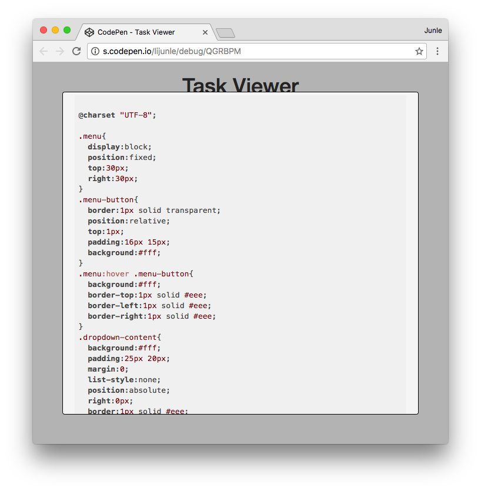
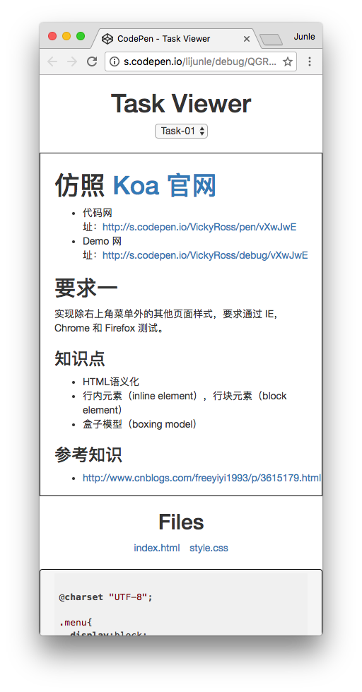

# Task 查看器

Task 查看器用来很方便地查看某个 Task 的 README 文件和其他文件。

## 要求一

在页面顶端是一个下拉框。下拉框的选项是当前项目所有 Task 的列表（Task-01，Task-02……）。默认选择 Task-01。

下拉框的下方是当前选中 Task 的 README 内容。当选中的 Task 改变时，README 内容更新为新选中的 Task 的 README 内容。

README 内容的下方，则是文件列表。这里列出当前选中的 Task 目录下，除了 README 之外的所有文件（`index.html`，`styles.css`……）。

当点击文件列表中的文件名时，把文件的内容展示出来。要求文件内容高亮显示。电脑和手机使用不同的展示位置。在电脑上，使用悬浮框的方式，在整体页面的悬浮上方展示；在手机上，则在文件列表的下方显示。

### 设计图

设计原型展示地址：http://s.codepen.io/lijunle/debug/QGRBPM

### GitHub API

- 获取文件目录结构和文件内容：https://developer.github.com/v3/repos/contents/#get-contents

### 参考资料

- Base64 操作：https://github.com/dankogai/js-base64
- Markdown：https://github.com/chjj/marked
- 代码高亮：https://highlightjs.org/
- 弹出框：http://getbootstrap.com/javascript/#modals
