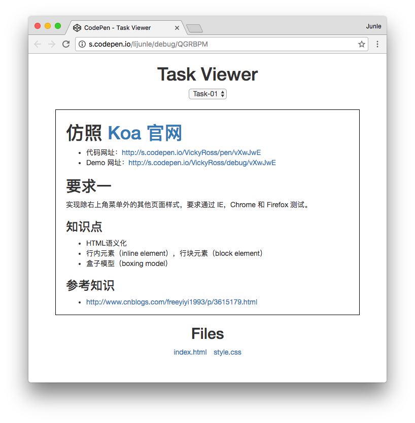
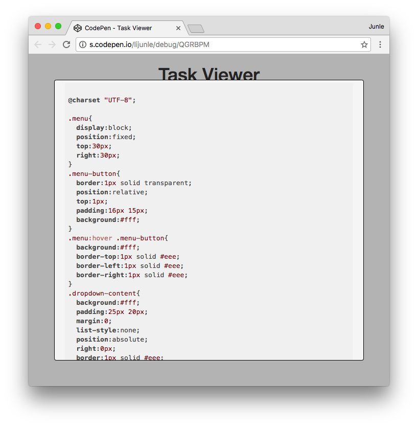
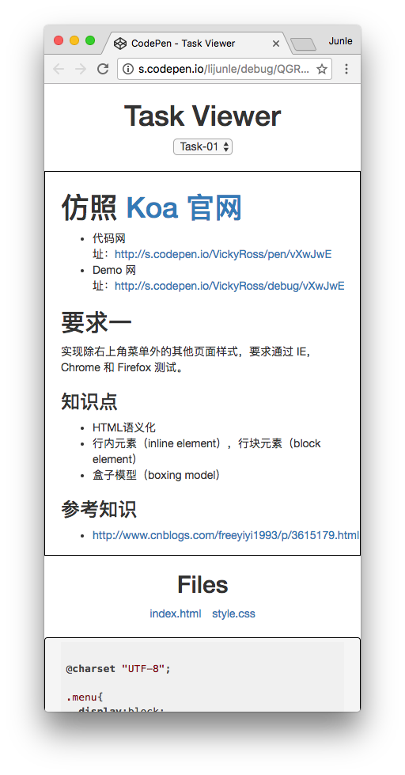

# Task 查看器

Task 查看器用来很方便地查看某个 Task 的 README 文件和其他文件。

## 要求一

在页面顶端是一个下拉框。下拉框的选项是当前项目所有 Task 的列表（Task-01，Task-02……）。默认选择 Task-01。

下拉框的下方是当前选中 Task 的 README 内容。当选中的 Task 改变时，README 内容更新为新选中的 Task 的 README 内容。

README 内容的下方，则是文件列表。这里列出当前选中的 Task 目录下，除了 README 之外的所有文件（`index.html`，`styles.css`……）。

当点击文件列表中的文件名时，把文件的内容展示出来。要求文件内容高亮显示。电脑和手机使用不同的展示位置。在电脑上，使用悬浮框的方式，在整体页面的悬浮上方展示；在手机上，则在文件列表的下方显示。

### 设计图

设计原型展示地址：http://s.codepen.io/lijunle/debug/QGRBPM

### GitHub API

- 获取文件目录结构和文件内容：https://developer.github.com/v3/repos/contents/#get-contents

### 参考资料

- Base64 操作：https://github.com/dankogai/js-base64
- Markdown：https://github.com/chjj/marked
- 代码高亮：https://highlightjs.org/
- 弹出框：http://getbootstrap.com/javascript/#modals

## 要求二

我们在前面一个Task中，了解了一个概念叫做REST，其中有一点是，一个URL对应一个资源。

在我们的要求一中，我们做了一个网站，里面可以切换各个Task，但是切换了Task之后，URL并不会相对应地变化。你也不能做到，切换到某个Task之后，把URL分别给别人，然后别人打开这个URL，就能直接看到你之前打开的Task。我们的例子就是没有负责“一个URL对应一个资源”这个原则。如果我们的网页能够符合这个原则。那我们的每个Task都可能单独被分享给别人，搜索引擎也可以索引我们的页面。

要求二就是要修改我们的页面，让网站符合这个原则。因此我们需要做到下面几点：

1. 当用户选中某个Task的时候，URL的hash值应该作出对应的变化，表示正在选中的Task。
2. 当页面最新加载之后，网页应该读取URL的hash值，跳到对应的Task去。
3. 当用户在页面作出多次选择之后，点击浏览器的“前进”和“后退”应该可以使页面选中正确的Task。

*Note：* 建议不要使用任何的辅助框架，使用HTML原生的API进行操作，理解前端跳转是怎么做的。

### 知识点

- 锚点（Anchor）
- URL Hash 值
- URL hashchange API

### 参考资料

- http://www.ruanyifeng.com/blog/2011/03/url_hash.html
- http://www.cnblogs.com/china-aspx/archive/2008/04/20/1162597.html
- https://developer.mozilla.org/zh-CN/docs/Web/API/Window/onhashchange
- http://www.voidcn.com/blog/aitangyong/article/p-872467.html （这个代码十分不符合HTML语义化，但是它的Hash处理部分还是可以读一读。）
